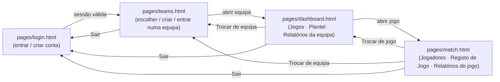

<!--
  Análise de Jogo — docs/architecture.md
  Documento técnico de arquitetura: como as páginas comunicam com o
  Supabase, fluxo de autenticação/sessão, estado no cliente (localStorage),
  modelo de segurança (RLS) e mapa de navegação entre páginas.

  Mantém isto atualizado sempre que a estrutura de páginas, o fluxo de
  autenticação, ou o modelo de segurança mudarem. Para o modelo de dados
  (tabelas/colunas), ver supabase/data-model.md; para funcionalidades e
  setup, ver o README.md.

  Versão: 1.0 (2026-07-14)
  Histórico:
    1.0 (2026-07-14) — criação.
-->

# Arquitetura — Análise de Jogo

## Visão geral

A aplicação é um site 100% estático (sem servidor próprio): HTML + CSS + JavaScript puro (ES modules, sem build step, sem framework), hospedado no GitHub Pages. Toda a persistência e autenticação passa diretamente do browser para o [Supabase](https://supabase.com) via `@supabase/supabase-js`, usando a chave pública ("anon key") — a segurança não vem de esconder essa chave, mas das políticas de Row Level Security definidas na base de dados (ver [Modelo de segurança](#modelo-de-segurança)).

```
Browser (pages/*.html + js/*.js)
   │
   │  fetch/WebSocket (via @supabase/supabase-js, chave anon)
   ▼
Supabase
   ├─ Auth        → contas (email + palavra-passe)
   ├─ Postgres     → tabelas + RLS + funções RPC (ver supabase/data-model.md)
   └─ Storage      → bucket "team-logos" (emblemas das equipas)
```

Não há backend próprio, API intermédia, nem variáveis de ambiente secretas — todo o código corre no browser do utilizador.

## Mapa de páginas e navegação



Cada página valida os pré-requisitos antes de se mostrar, e redireciona "para trás" se algum faltar — ver [Guardas de navegação](#guardas-de-navegação-por-página).

## Autenticação e sessão

- **Login/registo** (`js/login.js`): `supabase.auth.signInWithPassword` / `supabase.auth.signUp`, com validação simples de campos não vazios no cliente (evita cair no fluxo de login anónimo do Supabase quando os campos ficam em branco). Em caso de sucesso, redireciona sempre para `teams.html`.
- **Persistência de sessão**: gerida inteiramente pelo `supabase-js` (guarda o token no `localStorage` do browser, sob as suas próprias chaves — não confundir com as chaves de estado da app descritas abaixo). Não há gestão manual de tokens no código da app.
- **Verificação de sessão por página**: todas as páginas exceto `login.html` chamam `supabase.auth.getSession()` no arranque (`init()`); se não houver sessão, redirecionam para `login.html`.
- **Reação a logout noutra aba/dispositivo**: `dashboard.js` e `match.js` subscrevem `supabase.auth.onAuthStateChange`, e redirecionam para `login.html` assim que a sessão desaparece (ex: se fizeres logout noutra aba). `teams.js` só verifica a sessão uma vez no arranque, sem subscrição contínua.
- **Sair**: cada página com botão "Sair" chama `supabase.auth.signOut()` e limpa as chaves de estado local relevantes (ver abaixo) antes de redirecionar para `login.html`.

## Estado no cliente (localStorage)

A app usa duas chaves de `localStorage` para lembrar "onde estás", à parte da sessão do Supabase:

| Chave | Definida em | Lida em | Limpa em |
|---|---|---|---|
| `current_team_id` | `teams.js` (ao abrir/criar/entrar numa equipa) | `dashboard.js`, `match.js` (para saber a equipa atual) | "Sair" (todas as páginas); "Trocar de equipa" |
| `current_match_id` | `dashboard.js` (ao abrir/criar um jogo) | `match.js` (para saber o jogo atual) | "Sair"; "Trocar de jogo"; "Trocar de equipa" (fica órfã de qualquer forma, porque sem equipa não há jogo) |

Se `dashboard.html` for aberta sem `current_team_id` válido (ou a equipa deixou de existir/o utilizador deixou de ser membro), redireciona para `teams.html`. Da mesma forma, `match.html` sem `current_match_id` válido redireciona para `dashboard.html`. Isto permite recarregar a página (F5) ou colar o link diretamente sem perder o contexto, enquanto as chaves continuarem válidas.

Há ainda chaves antigas de uma versão anterior (pré-Supabase), só lidas por `dashboard.js` para oferecer a importação de dados locais: `jogadores_v1` e `<tracker_id>_clicks_v1` (`faltas_clicks_v1`, `cantos_clicks_v1`, etc.) — nunca escritas pela versão atual, só existem em browsers que usaram a app antes da migração para Supabase.

## Guardas de navegação por página

Cada página faz uma cadeia de verificações no arranque (`init()`), na ordem indicada, redirecionando assim que uma falha:

1. **`teams.html`**: sessão válida → senão `login.html`.
2. **`dashboard.html`**: sessão válida → `current_team_id` existe → a equipa existe e o utilizador é membro dela (a própria query já filtra por RLS) → senão `login.html` ou `teams.html`, consoante o que falhou.
3. **`match.html`**: sessão válida → `current_team_id`/equipa válidos → `current_match_id` existe → o jogo existe e pertence a essa equipa → senão `login.html`, `teams.html` ou `dashboard.html`.

Este padrão (validar de fora para dentro: sessão → equipa → jogo) repete-se em `dashboard.js` e `match.js` de forma quase idêntica — ver a função `init()` em cada ficheiro.

## Modelo de segurança

- **Row Level Security (RLS)** em todas as tabelas de dados da app, baseada em pertença a uma equipa: uma linha só é visível/editável por quem tem uma entrada correspondente em `team_members`. O `user_id` gravado em cada linha serve só de registo de autoria, **não** é usado para controlo de acesso — dois membros da mesma equipa veem e editam sempre os mesmos dados. Ver `supabase/data-model.md` para o detalhe de cada política.
- **Funções RPC `security definer`** (`create_team`, `join_team_by_code`): usadas quando uma operação precisa de escrever em mais do que uma tabela de forma atómica (criar equipa + inserir o "owner" em `team_members`), contornando a RLS só dentro da própria função, de forma controlada.
- **Storage** (bucket `team-logos`, público para leitura): upload/substituição de um emblema só é permitido a membros da equipa dona desse emblema, validado pelo caminho do ficheiro (`<team_id>/...`) contra `team_members`.
- **Chave anon pública**: é suposto ser pública (fica no código-fonte, em `js/supabase-client.js`); a segurança nunca depende de a esconder, só das políticas RLS acima.

## Padrões de código usados em várias páginas

- **`el(id)`**: helper `document.getElementById` repetido em todos os ficheiros JS (não é um módulo partilhado — cada página tem a sua própria cópia, de propósito, para não haver dependência extra num projeto sem build step).
- **Atualização otimista**: ao clicar numa célula (cartão, golo, estado, ponto no campo), a UI atualiza-se imediatamente em memória e no ecrã, e só depois o pedido ao Supabase é disparado em segundo plano — não há "loading state" à espera da resposta do servidor.
- **Padrão de clique/contador**: usado nos 5 campos do Registo de Jogo (`js/match.js`, `initTracker()`) e nas células de estatísticas da convocatória — clique esquerdo regista/soma, clique direito ou Ctrl+clique remove/subtrai.
- **Estado de "parte a decorrer"** (`isPeriodoRunning()`, `isLocked()`, `currentParte()` em `js/match.js`): três perguntas simples sobre os timestamps de `matches` (`parteN_inicio`/`parteN_fim`) que controlam, em cascata, o que pode ser editado em cada tab — sem guardar um "estado" separado, é sempre derivado desses timestamps.
- **Exportação CSV**: `wireDownloadSession()` em `js/match.js` gera um único ficheiro com várias secções (`=== NOME ===`), uma por tabela relevante — sem dependências externas, só `Blob` + `URL.createObjectURL`.

## Onde encontrar cada coisa

| Preciso de perceber... | Vai a |
|---|---|
| O que cada página faz e desde quando | Cabeçalho de versão no topo de cada `.html`/`.js` (ver [README § Versão e comentários](../README.md)) |
| A estrutura da base de dados | `supabase/data-model.md` |
| Como configurar um Supabase novo, ou correr localmente | `README.md` |
| O fluxo de login/sessão, navegação entre páginas, ou o modelo de segurança | este documento |
