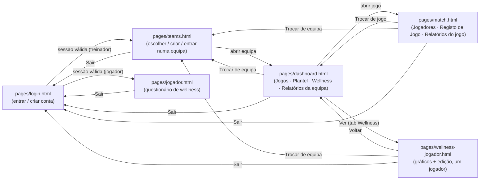

<!--
  Análise de Jogo — docs/architecture.md
  Documento técnico de arquitetura: como as páginas comunicam com o
  Supabase, fluxo de autenticação/sessão, estado no cliente (localStorage),
  modelo de segurança (RLS) e mapa de navegação entre páginas.

  Mantém isto atualizado sempre que a estrutura de páginas, o fluxo de
  autenticação, ou o modelo de segurança mudarem. Para o modelo de dados
  (tabelas/colunas), ver supabase/data-model.md; para funcionalidades e
  setup, ver o README.md.

  Versão: 1.19 (2026-08-27)
  Histórico:
    1.0 (2026-07-14) — criação.
    1.1 (2026-07-15) — popup de escolha de jogador após o clique, no Registo de Jogo.
    1.2 (2026-07-15) — mapa de calor por zonas (zona calculada em SQL, não no browser).
    1.3 (2026-07-15) — exportação do relatório em PDF via impressão do browser.
    1.4 (2026-08-05) — jogadores com login próprio (questionário de wellness diário),
                        segundo tipo de utilizador além do treinador.
    1.5 (2026-08-05) — "utilizador" do jogador passa a ser gerado automaticamente a
                        partir do nome (o treinador só define a password).
    1.6 (2026-08-05) — exportação da tab Wellness para Excel (.xlsx) via SheetJS —
                        primeira dependência externa além do supabase-js.
    1.7 (2026-08-07) — jogador.html deixa de ter o passo "Completa o teu perfil"
                        no primeiro login; entra logo no questionário do dia.
    1.8 (2026-08-07) — nova página wellness-jogador.html (gráficos Chart.js + edição
                        de um dia pelo treinador); RLS ganha wellness_team_member_update.
    1.9 (2026-08-07) — RLS ganha wellness_team_member_insert: o treinador também pode
                        criar uma resposta em nome de um jogador.
    1.10 (2026-08-07) — wellness-jogador.html ganha 5 gráficos (um por métrica, em vez
                         de 4 linhas juntas) e exportação PDF/Excel.
    1.11 (2026-08-27) — registo normalizado (pages/match.html) passa a mostrar 3 mapas
                         por campo (1ª Parte/2ª Parte/Ambas), cada um com seta fixa de
                         orientação de ataque.
    1.12 (2026-08-27) — corrige o PDF do relatório: a tabela de log deixa de ficar
                         cortada (perdia o scroll do ecrã na impressão) e cada campo
                         passa a começar numa página nova.
    1.13 (2026-08-27) — corrige "h3.part-title" a ficar órfão no fim de uma página
                         no PDF (faltava break-after: avoid); e acrescenta
                         ".print-only-header" (padrão já usado em wellness-jogador.html)
                         ao relatório, com o adversário/data, já que os cabeçalhos/
                         rodapés do diálogo de impressão do browser não são
                         controláveis por CSS/JS de uma página.
    1.14 (2026-08-27) — a correção 1.13 não bastava em todo o Chrome: ".tracker"/
                         ".tracker-parts"/".tracker-part" passam de "display: flex"
                         a "display: block" na impressão (o motor de paginação do
                         Chrome não é fiável a fragmentar DENTRO de flex), e
                         ".print-heat-pair" passa de flex a tabela CSS.
    1.15 (2026-08-27) — o mapa de calor passa a mostrar o número de ocorrências
                         dentro de cada célula da grelha (antes só existia como
                         atributo "title", que nunca chegava a aparecer porque
                         ".heat-grid" tem pointer-events: none).
    1.16 (2026-08-27) — ".attack-arrow" deixa de ficar sobreposta à imagem do campo
                         (o que tapava números do mapa de calor no canto superior
                         esquerdo) — passa a legenda por cima do campo, fora do
                         ".field-wrap".
    1.17 (2026-08-27) — corrige bug grave introduzido em 1.16: a seta usava a mesma
                         classe "screen-field" do ".field-wrap", e o querySelector que
                         localiza onde desenhar os pontos do Registo de Jogo apanhava a
                         seta em vez do campo — os pontos apareciam espalhados pela
                         página inteira (a seta não é position: relative). Classe
                         renomeada para "arrow-live-field" e os querySelector afetados
                         tornados mais específicos (".field-wrap.screen-field").
    1.18 (2026-08-27) — número do jogador no Plantel (pages/dashboard.html) passa a
                         ser editável diretamente na tabela, sem precisar de o remover
                         e recriar para corrigir um jogador convocado sem número.
    1.19 (2026-08-27) — número do jogador na convocatória de cada jogo (tab Jogadores,
                         pages/match.html) passa a ser editável, sobrepondo-se ao número
                         de base do Plantel só nesse jogo (match_players.numero, ver
                         supabase/migrations/019_match_players_numero.sql) — para
                         equipas onde o número muda de jogo para jogo.
-->

# Arquitetura — Análise de Jogo

## Visão geral

A aplicação é um site 100% estático (sem servidor próprio): HTML + CSS + JavaScript puro (ES modules, sem build step, sem framework), hospedado no GitHub Pages. Toda a persistência e autenticação passa diretamente do browser para o [Supabase](https://supabase.com) via `@supabase/supabase-js`, usando a chave pública ("anon key") — a segurança não vem de esconder essa chave, mas das políticas de Row Level Security definidas na base de dados (ver [Modelo de segurança](#modelo-de-segurança)).

```
Browser (pages/*.html + js/*.js)
   │
   │  fetch/WebSocket (via @supabase/supabase-js, chave anon)
   ▼
Supabase
   ├─ Auth        → contas (email + palavra-passe)
   ├─ Postgres     → tabelas + RLS + funções RPC (ver supabase/data-model.md)
   └─ Storage      → bucket "team-logos" (emblemas das equipas)
```

Não há backend próprio, API intermédia, nem variáveis de ambiente secretas — todo o código corre no browser do utilizador.

## Mapa de páginas e navegação


```mermaid
flowchart LR
  L["pages/login.html<br/>(entrar / criar conta)"]
  T["pages/teams.html<br/>(escolher / criar / entrar numa equipa)"]
  D["pages/dashboard.html<br/>(Jogos · Plantel · Wellness · Relatórios da equipa)"]
  M["pages/match.html<br/>(Jogadores · Registo de Jogo · Relatórios do jogo)"]
  J["pages/jogador.html<br/>(questionário de wellness)"]
  W["pages/wellness-jogador.html<br/>(gráficos + edição, um jogador)"]

  L -->|"sessão válida (treinador)"| T
  L -->|"sessão válida (jogador)"| J
  T -->|abrir equipa| D
  D -->|abrir jogo| M
  D -->|"Ver (tab Wellness)"| W
  W -->|"Voltar"| D
  M -->|"Trocar de jogo"| D
  D -->|"Trocar de equipa"| T
  M -->|"Trocar de equipa"| T
  W -->|"Trocar de equipa"| T
  T -->|"Sair"| L
  D -->|"Sair"| L
  M -->|"Sair"| L
  J -->|"Sair"| L
  W -->|"Sair"| L
```

Cada página valida os pré-requisitos antes de se mostrar, e redireciona "para trás" se algum faltar — ver [Guardas de navegação](#guardas-de-navegação-por-página). `jogador.html` fica completamente à parte do resto (nunca leva a `teams.html`/`dashboard.html`/`match.html`) — é a única página pensada para outro tipo de utilizador, não o treinador.

## Autenticação e sessão

Há **dois tipos de utilizador**, ambos autenticados da mesma forma (Supabase Auth, email + palavra-passe), mas com vistas completamente diferentes:
- **Treinador/adjunto**: cria a própria conta em `login.html`, junta-se a uma equipa (`team_members`) e usa `teams.html`/`dashboard.html`/`match.html`.
- **Jogador**: não cria a própria conta — o treinador cria o login por ele, na tab Plantel de `dashboard.html` (ver [Padrões de código](#padrões-de-código-usados-em-várias-páginas)). Fica associado a uma linha em `players` via `auth_user_id`, e só vê `jogador.html`.

- **Login/registo** (`js/login.js`): `supabase.auth.signInWithPassword` / `supabase.auth.signUp`, com validação simples de campos não vazios no cliente (evita cair no fluxo de login anónimo do Supabase quando os campos ficam em branco). Depois de entrar, verifica se a conta está associada a um jogador (`players.auth_user_id`) — se estiver, redireciona para `jogador.html`; senão, para `teams.html` (fluxo do treinador).
- **Persistência de sessão**: gerida inteiramente pelo `supabase-js` (guarda o token no `localStorage` do browser, sob as suas próprias chaves — não confundir com as chaves de estado da app descritas abaixo). Não há gestão manual de tokens no código da app.
- **Verificação de sessão por página**: todas as páginas exceto `login.html` chamam `supabase.auth.getSession()` no arranque (`init()`); se não houver sessão, redirecionam para `login.html`.
- **Reação a logout noutra aba/dispositivo**: `dashboard.js` e `match.js` subscrevem `supabase.auth.onAuthStateChange`, e redirecionam para `login.html` assim que a sessão desaparece (ex: se fizeres logout noutra aba). `teams.js` só verifica a sessão uma vez no arranque, sem subscrição contínua.
- **Sair**: cada página com botão "Sair" chama `supabase.auth.signOut()` e limpa as chaves de estado local relevantes (ver abaixo) antes de redirecionar para `login.html`.

## Estado no cliente (localStorage)

A app usa duas chaves de `localStorage` para lembrar "onde estás", à parte da sessão do Supabase:

| Chave | Definida em | Lida em | Limpa em |
|---|---|---|---|
| `current_team_id` | `teams.js` (ao abrir/criar/entrar numa equipa) | `dashboard.js`, `match.js` (para saber a equipa atual) | "Sair" (todas as páginas); "Trocar de equipa" |
| `current_match_id` | `dashboard.js` (ao abrir/criar um jogo) | `match.js` (para saber o jogo atual) | "Sair"; "Trocar de jogo"; "Trocar de equipa" (fica órfã de qualquer forma, porque sem equipa não há jogo) |
| `current_wellness_player_id` | `dashboard.js` (botão "Ver" na tab Wellness) | `wellness-jogador.js` (para saber de que jogador é a página) | "Sair"; fica órfã ao trocar de equipa (a query seguinte falha e redireciona) |

Se `dashboard.html` for aberta sem `current_team_id` válido (ou a equipa deixou de existir/o utilizador deixou de ser membro), redireciona para `teams.html`. Da mesma forma, `match.html` sem `current_match_id` válido redireciona para `dashboard.html`. Isto permite recarregar a página (F5) ou colar o link diretamente sem perder o contexto, enquanto as chaves continuarem válidas.

Há ainda chaves antigas de uma versão anterior (pré-Supabase), só lidas por `dashboard.js` para oferecer a importação de dados locais: `jogadores_v1` e `<tracker_id>_clicks_v1` (`faltas_clicks_v1`, `cantos_clicks_v1`, etc.) — nunca escritas pela versão atual, só existem em browsers que usaram a app antes da migração para Supabase.

## Guardas de navegação por página

Cada página faz uma cadeia de verificações no arranque (`init()`), na ordem indicada, redirecionando assim que uma falha:

1. **`teams.html`**: sessão válida → senão `login.html`.
2. **`dashboard.html`**: sessão válida → `current_team_id` existe → a equipa existe e o utilizador é membro dela (a própria query já filtra por RLS) → senão `login.html` ou `teams.html`, consoante o que falhou.
3. **`match.html`**: sessão válida → `current_team_id`/equipa válidos → `current_match_id` existe → o jogo existe e pertence a essa equipa → senão `login.html`, `teams.html` ou `dashboard.html`.
4. **`jogador.html`**: sessão válida → existe uma linha em `players` com `auth_user_id` igual ao utilizador atual → senão `login.html` (com aviso — conta não associada a nenhum jogador). Não depende de `current_team_id`/`current_match_id`: a equipa do jogador vem sempre da própria linha em `players`.
5. **`wellness-jogador.html`**: sessão válida → `current_team_id`/equipa válidos → `current_wellness_player_id` existe e esse jogador pertence a essa equipa → senão `teams.html` ou `dashboard.html`.

Este padrão (validar de fora para dentro: sessão → equipa → jogo) repete-se em `dashboard.js` e `match.js` de forma quase idêntica — ver a função `init()` em cada ficheiro.

## Modelo de segurança

- **Row Level Security (RLS)** em todas as tabelas de dados da app, baseada em pertença a uma equipa: uma linha só é visível/editável por quem tem uma entrada correspondente em `team_members`. O `user_id` gravado em cada linha serve só de registo de autoria, **não** é usado para controlo de acesso — dois membros da mesma equipa veem e editam sempre os mesmos dados. Ver `supabase/data-model.md` para o detalhe de cada política.
- **Acesso do jogador (sem ser `team_member`)**: um jogador com login próprio (`players.auth_user_id`) não pertence a `team_members`, mas ganha duas policies adicionais (que se juntam por OR às de cima): vê/edita só a própria linha em `players` (`players_self_select`, usada em `jogador.js` para ler o próprio nome; `players_self_update` fica disponível, mas nenhum fluxo atual a usa — o perfil deixou de ser editável pelo jogador), e vê só as próprias linhas em `wellness_responses` (`wellness_player_select`). Nunca vê jogos, plantel de outros jogadores, ou qualquer outra tabela.
- **Escrita do wellness**: o jogador só pode criar a própria resposta do dia via a função `submit_wellness()` (`security definer`, identifica-o pelo próprio `auth.uid()`, nunca recebe um `player_id` do cliente, e usa a restrição `unique (player_id, data)` para impedir mais de uma resposta por dia). O treinador tem duas policies diretas na tabela (sem RPC): `wellness_team_member_insert` (criar uma resposta em nome de um jogador — ex: um dia esquecido, ou dados de teste/demo) e `wellness_team_member_update` (corrigir qualquer campo de qualquer dia). Já o jogador só pode alterar o próprio `peso` depois de enviado (função `update_wellness_peso()`) — os restantes campos ficam fixos para ele, só o treinador os pode mudar.
- **Funções RPC `security definer`** (`create_team`, `join_team_by_code`): usadas quando uma operação precisa de escrever em mais do que uma tabela de forma atómica (criar equipa + inserir o "owner" em `team_members`), contornando a RLS só dentro da própria função, de forma controlada.
- **Storage** (bucket `team-logos`, público para leitura): upload/substituição de um emblema só é permitido a membros da equipa dona desse emblema, validado pelo caminho do ficheiro (`<team_id>/...`) contra `team_members`.
- **Chave anon pública**: é suposto ser pública (fica no código-fonte, em `js/supabase-client.js`); a segurança nunca depende de a esconder, só das políticas RLS acima.

## Padrões de código usados em várias páginas

- **`el(id)`**: helper `document.getElementById` repetido em todos os ficheiros JS (não é um módulo partilhado — cada página tem a sua própria cópia, de propósito, para não haver dependência extra num projeto sem build step).
- **Atualização otimista**: ao clicar numa célula (cartão, golo, estado, ponto no campo), a UI atualiza-se imediatamente em memória e no ecrã, e só depois o pedido ao Supabase é disparado em segundo plano — não há "loading state" à espera da resposta do servidor.
- **Padrão de clique/contador**: usado nos 5 campos do Registo de Jogo (`js/match.js`, `initTracker()`) e nas células de estatísticas da convocatória — clique esquerdo regista/soma, clique direito ou Ctrl+clique remove/subtrai.
- **Estado de "parte a decorrer"** (`isPeriodoRunning()`, `isLocked()`, `currentParte()` em `js/match.js`): três perguntas simples sobre os timestamps de `matches` (`parteN_inicio`/`parteN_fim`) que controlam, em cascata, o que pode ser editado em cada tab — sem guardar um "estado" separado, é sempre derivado desses timestamps. `applyLockState()` aplica isso visualmente (opacidade/`pointer-events`/`disabled`) às linhas já renderizadas da tabela de convocados — tem de correr de novo sempre que a tabela é reconstruída (`loadMatchPlayers()`), porque o `innerHTML = ''` de `renderMatchPlayers()` perde qualquer estilo inline aplicado antes.
- **Número do jogador por jogo**: a coluna "Nº" da convocatória (`renderMatchPlayers()`, `js/match.js`) é sempre um `<input class="match-numero-input">`, tal como a mesma coluna no Plantel (`renderRoster()`, `dashboard.js`) — grava em `match_players.numero`, que se sobrepõe ao número de base em `players.numero` só nesse jogo (`matchPlayerNumero()` centraliza essa prioridade, usada também na ordenação, no popup de jogador e no CSV exportado). Existe porque um jogador pode ter números diferentes em jogos diferentes (cedido a outra equipa, camisola diferente por indisponibilidade da habitual) — editar o Plantel mudaria o número em todos os jogos, incluindo os já terminados. Editável na mesma janela que o `Estado`/remover (até o jogo terminar), não só antes do jogo começar.
- **Exportação CSV**: `wireDownloadSession()` em `js/match.js` gera um único ficheiro com várias secções (`=== NOME ===`), uma por tabela relevante — sem dependências externas, só `Blob` + `URL.createObjectURL`.
- **Popup pós-clique (jogador)**: depois de marcar um ponto no Registo de Jogo, `showJogadorPopup()` (`js/match.js`) mostra um popup junto ao clique, para (opcionalmente) dizer quem fez a ação — sem bloquear o registo em si, que já foi gravado antes do popup aparecer. A lista de jogadores é filtrada por `onFieldMatchPlayers()` (titulares que não saíram + suplentes que já entraram, com fallback para todos os convocados se essa lista estiver vazia), mostrados só pelo número da camisola, para caber ~11 opções num popup pequeno sem ficar visualmente pesado. Fecha ao tocar num número, ao clicar fora, ou automaticamente ao início do clique seguinte (o novo `pointerdown` fecha o popup antigo antes do novo `click` disparar). Um clique sem jogador escolhido fica com `player_id` a `null`, e pode ser corrigido depois na tabela de registo (ao vivo) ou no registo normalizado (pós-jogo).
- **Mapa de calor por zonas**: a "zona" (grelha 6×4) de cada ponto é calculada em SQL, como colunas `zona_col`/`zona_row` da view `events_normalizado` (ver `supabase/migrations/013_events_zona.sql`) — não no browser — para essa definição viver num único sítio e poder ser consultada diretamente por SQL ou outras ferramentas no futuro, sem reimplementar a lógica de "binning". `buildHeatGrid()`/`renderHeatGrid()` (`js/match.js`) só agregam essas colunas já calculadas numa grelha visual; os nomes `HEATMAP_COLS`/`HEATMAP_ROWS` em JS têm de ficar sincronizados com os `6`/`4` hardcoded na view SQL. Cada um dos 3 mapas de um campo (ver ponto seguinte) tem o seu próprio toggle Pontos/Mapa de Calor, e — só na vista de mapa de calor — um segundo toggle para escolher o tipo (X/Y, ex: "A Favor"/"Contra"), porque misturar os dois tipos no mesmo mapa não faz sentido tacticamente. `normalizadoPointsCache` guarda os pontos de todo o jogo já filtrados por tracker (ambas as partes); a filtragem por 1ª/2ª/Ambas é feita a jusante, por `NORMALIZADO_PARTES` (`js/match.js`), para trocar de vista/tipo/parte sem nova consulta ao Supabase. Cada célula com pontos mostra o número de ocorrências escrito por cima da cor (não só um `title` — a grelha `.heat-grid` tem `pointer-events: none`, herdado pelas células, por isso um tooltip nunca chegaria a aparecer; o número visível é a única forma de mostrar a contagem).
- **Registo normalizado em 3 mapas por campo (1ª Parte / 2ª Parte / Ambas)**: cada campo (Faltas, Cantos, Cruzamentos, Perdas de Bola, Remates) mostra em simultâneo `.tracker-parts` (`js/match.js`, `buildPartBlockHtml()`) com 3 blocos lado a lado (empilhados em ecrãs estreitos, ou no PDF), um por cada entrada de `NORMALIZADO_PARTES` — filtros simples sobre `p.parte` (1, 2, ou sem filtro para "Ambas"), aplicados sobre os mesmos pontos já normalizados de `normalizadoPointsCache`, sem pedir dados diferentes ao Supabase por bloco. Cada bloco tem o seu próprio estado de vista (Pontos/Mapa de Calor) e tipo (X/Y) — `partBlock.dataset.heatTipo` — independente dos outros 2 blocos do mesmo campo. Como a view `events_normalizado` já roda os pontos da parte que atacou "ao contrário" (ver migração 009), a equipa ataca sempre da esquerda para a direita nos 3 mapas — daí `attackArrowHtml()` colocar em cada mapa (screen e print) uma seta fixa "Ataque →" (`.attack-arrow`, não interativa), só como legenda, distinta da seta interativa `#btn-orientacao` do cronómetro (essa sim, muda consoante a orientação real escolhida no jogo). A seta fica **por cima** do campo (fora do `.field-wrap`, em fluxo normal, não `position: absolute` sobre a imagem) — a versão anterior sobrepunha o canto superior esquerdo e chegou a tapar o número de ocorrências do mapa de calor quando calhava nesse setor. `attackArrowHtml('arrow-live-field')` marca a instância do campo interativo com a classe `.arrow-live-field`, escondida junto com `.screen-field` na impressão (`@media print`) — sem essa marca ficaria órfã no PDF, já que deixou de estar aninhada dentro do elemento escondido. **Cuidado ao escolher esse nome**: a primeira versão reutilizou a classe `.screen-field` (a mesma do `.field-wrap`), e como `loadNormalizadoReport()` localiza onde desenhar os pontos com `partBlock.querySelector('.screen-field')`, passou a apanhar a seta (que vem antes do campo no HTML) em vez do campo em si — como a seta não é `position: relative`, os `.marker` absolutamente posicionados lá dentro escapavam para o *initial containing block* do documento, aparecendo espalhados pela página inteira. Por isso a classe da seta é `arrow-live-field` (nome propositadamente diferente de `screen-field`), e os `querySelector` que precisam mesmo do campo usam `.field-wrap.screen-field` (mais específico) em vez de `.screen-field` sozinho.
- **Exportação do relatório em PDF**: o botão "Exportar relatório (PDF)" chama `window.print()` — sem nenhuma dependência nova (`jsPDF`/`html2canvas` ficam como opção futura só se o relatório crescer para vários tipos de gráfico). Uma folha `@media print` em `css/styles.css` esconde tudo exceto a tab Relatórios (mesmo que não seja a tab ativa no momento, via `display: block !important` a sobrepor o atributo `hidden`). Cada um dos 3 blocos de parte (`.tracker-part`) tem, em paralelo ao campo interativo (`.screen-field`, escondido na impressão), uma estrutura só para impressão (`.print-heat-pair`, escondida no ecrã) com **os dois mapas de calor sempre lado a lado** (X e Y) — preenchida por `prepareReportForPrint()` a partir do `normalizadoPointsCache`, filtrado por `NORMALIZADO_PARTES` mais uma vez por tipo, independentemente do que estiver escolhido no ecrã, porque o documento exportado não deve depender de um estado efémero da UI. No PDF, os 3 blocos de parte empilham-se verticalmente (em vez de lado a lado como no ecrã), porque 3 pares X/Y lado a lado não caberiam numa folha em pé; `.field-wrap`/`.tracker-part` têm `break-inside: avoid` para não cortar a meio entre páginas. Cada campo (`.tracker`) tem `break-before: page` — exceto o primeiro (`.tracker:first-child`, que continua logo a seguir ao resto da tab em vez de abrir uma página em branco) — para nunca misturar o fim de um campo com o início do seguinte; e `#normalizado-card` (o cartão que junta os 5 campos) tem de sobrepor o `break-inside: avoid` genérico de `.players-card`, porque, ao contrário dos outros cartões (mais curtos, pensados para nunca serem cortados), este é suposto ocupar várias páginas. A tabela de log (`.log`) também tinha `max-height`/`overflow-y: auto` (o scroll usado no ecrã) — na impressão isso cortava a tabela a meio em vez de a continuar na página seguinte, por isso essas duas propriedades são removidas dentro do `@media print`. `break-inside: avoid` num contentor (`.tracker-part`) nem sempre é suficiente sozinho para manter um título junto ao que vem a seguir — no Chrome, `h3.part-title` ("1ª Parte"/"2ª Parte"/"Ambas as Partes") podia ficar órfão no fim de uma página, com os seus próprios mapas a saltar para a página seguinte; por isso `h3.part-title` também precisa de `break-after: avoid` (a mesma regra que já existia só em `.tracker-title`/`.counters`). Isto ainda não chegava em todos os Chrome: `.tracker`/`.tracker-parts`/`.tracker-part` são `display: flex` no ecrã, e o motor de paginação do Chrome tem uma limitação antiga e bem documentada — não fragmenta de forma fiável **dentro de contentores flex** (o suporte tem vindo a ser adicionado aos poucos ao longo de várias versões, por isso o comportamento varia por versão do browser). A correção definitiva foi tirar o flex do caminho na impressão: os três passam a `display: block` só dentro do `@media print` (a paginação por blocos é fiável há décadas em qualquer browser), e `.print-heat-pair` passa de `display: flex` a `display: table` (com `.print-heat-col` como `table-cell`) — tabelas também têm suporte de paginação sólido, e continuam a mostrar os dois mapas lado a lado. Como `gap` só funciona em flex/grid/multicol, o espaçamento entre título/contadores/mapas que antes vinha do `gap` do flex passa a vir de margens explícitas nesse mesmo bloco `@media print`. O relatório usa ainda `.print-only-header` (o mesmo padrão de `wellness-jogador.html`, ver `updatePrintHeader()` em `js/match.js`) para mostrar "vs adversário — data" no topo do PDF — necessário porque o cabeçalho/rodapé do diálogo de impressão do browser (URL, data, número de página) não é controlável por CSS/JS de uma página; o `hint` ao lado do botão "Exportar relatório (PDF)" explica ao utilizador como desativar isso nas opções do próprio diálogo.
- **Criar o login de um jogador sem perder a sessão do treinador**: `supabase.auth.signUp()` substitui a sessão ativa do cliente que o chama — se o treinador o chamasse no cliente principal (`js/supabase-client.js`), ficava automaticamente com a sessão trocada para a conta nova, desligado da própria. Em vez disso, `dashboard.js` (tab Plantel, "Criar login") cria uma **segunda instância do cliente Supabase**, só para esse passo, com `{ auth: { persistSession: false, autoRefreshToken: false } }` — a conta é criada nesse cliente à parte, sem tocar na sessão principal; de seguida, um `update` normal em `players` (no cliente principal, sessão do treinador intacta) associa `auth_user_id`/`login_email` a esse jogador — já permitido pela RLS existente, porque o treinador é `team_member`. `SUPABASE_URL`/`SUPABASE_ANON_KEY` são exportadas por `supabase-client.js` precisamente para este segundo cliente as poder reutilizar.
- **"Utilizador" do jogador gerado automaticamente**: o Supabase Auth exige sempre um campo com formato de email, mas o jogador não precisa de ter um email real — `generateLoginUsername()` (`dashboard.js`) gera um a partir do nome (slug sem acentos + sufixo aleatório, ex: `joao-silva-x7k9@jogador.app`), mostrado num campo `readonly` para o treinador copiar. O treinador só escolhe/edita a palavra-passe.
- **Número do jogador editável no Plantel**: a coluna "Nº" de `renderRoster()` (`dashboard.js`) é sempre um `<input class="roster-number-input">` (reaproveitando o estilo de `.wellness-edit-input`), não só texto — útil quando o treinador convoca um jogador antes de saber o número definitivo. Grava no evento `change` (delegado em `#roster-body`, o mesmo padrão do `.log-player-select` em `js/match.js`), com Enter a disparar o `blur()` para não obrigar a clicar fora do campo; atualiza `rosterCache` em memória em vez de recarregar a tabela toda, para não perder o foco a meio da edição.
- **Exportação Excel (.xlsx) do Wellness**: 1ª exceção à filosofia "zero dependências" do resto da app — `dashboard.js` importa [SheetJS](https://sheetjs.com) (`xlsx`, via CDN `esm.sh`, tal como o `@supabase/supabase-js`) porque um `.xlsx` real (múltiplas folhas, tal como o Excel o entende) não é razoável de gerar à mão como o CSV existente. Cada exportação (`exportWellnessDaily()`/`exportWellnessWeekly()`) monta as folhas como arrays-de-arrays (`XLSX.utils.aoa_to_sheet`) e descarrega com `XLSX.writeFile()` — sem passar por Blob/`<a download>` manual, a biblioteca trata disso. A exportação semanal usa sempre a semana civil (segunda a domingo) que contém a data de hoje, calculada em `startOfWeek()`.
- **Gráficos de evolução do Wellness**: 2ª exceção — `wellness-jogador.js` importa [Chart.js](https://www.chartjs.org) (`chart.js/auto`, via CDN `esm.sh`) para 5 gráficos de linha, um por métrica (Dores/Stress/Fadiga/Sono 0-10, e Peso à parte por ter escala diferente) — cada cartão já mostra o nome na `h2.tracker-title`, por isso a legenda do Chart.js fica desligada em cada um. O toggle Semana/Mês/Total é sempre uma **janela deslizante** a partir de hoje (últimos 7/30 dias, ou tudo), não fixa ao calendário como a exportação semanal — para mostrar sempre a tendência mais recente, seja qual for o dia em que o treinador está a ver. Os gráficos são recriados (`chart.destroy()` + `new Chart(...)`) sempre que a janela muda ou uma resposta é editada, em vez de atualizados in-place; guardados no objeto `charts` (por id de métrica), não em variáveis separadas.
- **Exportações de `wellness-jogador.html`**: os dois botões reutilizam padrões já existentes em vez de inventar um terceiro — "Exportar gráficos (PDF)" é só `window.print()` com regras `@media print` (mesma abordagem do relatório do jogo em `match.js`; os `<canvas>` do Chart.js imprimem bem tal como estão, sem tratamento especial); "Exportar tabela (Excel)" usa o SheetJS já importado para os exports do dashboard.

## Onde encontrar cada coisa

| Preciso de perceber... | Vai a |
|---|---|
| O que cada página faz e desde quando | Cabeçalho de versão no topo de cada `.html`/`.js` (ver [README § Versão e comentários](../README.md)) |
| A estrutura da base de dados | `supabase/data-model.md` |
| Como configurar um Supabase novo, ou correr localmente | `README.md` |
| O fluxo de login/sessão, navegação entre páginas, ou o modelo de segurança | este documento |
