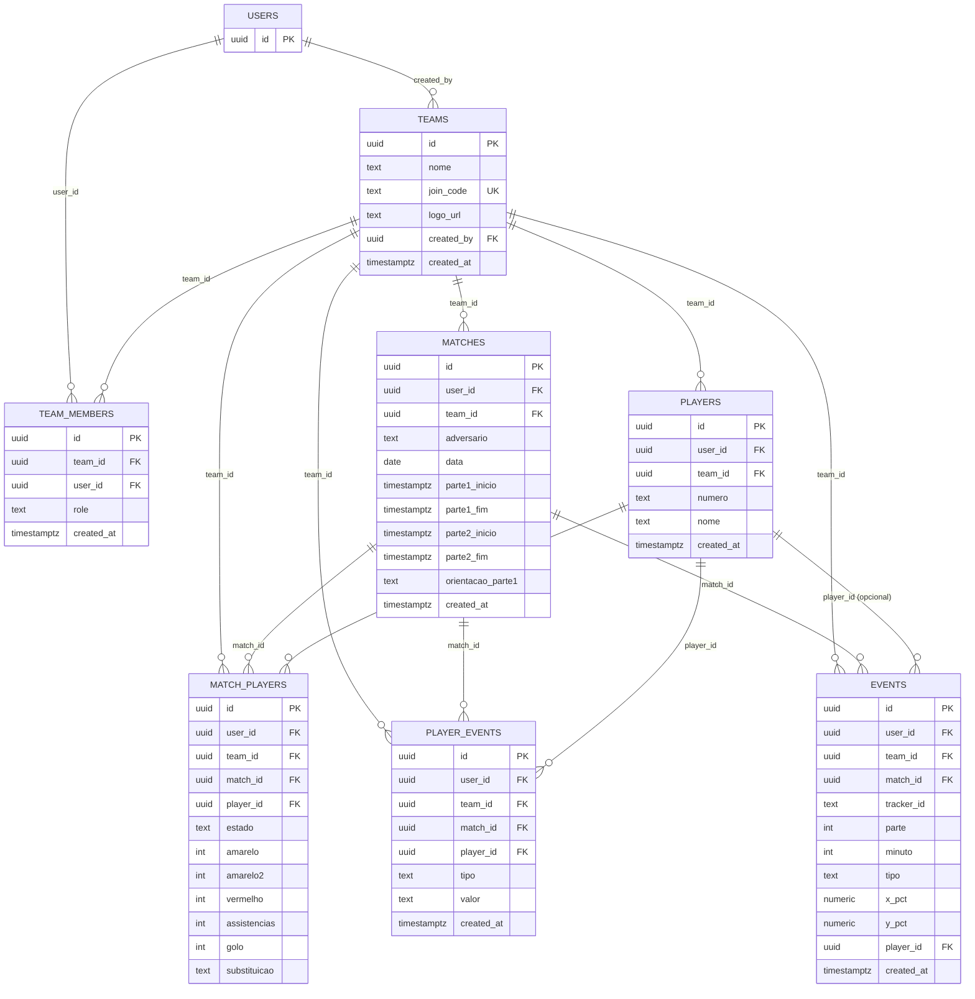

<!--
  Análise de Jogo — supabase/data-model.md
  Logical Data Model da base de dados (Postgres / Supabase): diagrama de
  entidades e relações, seguido de um dicionário de dados por tabela.

  Mantém isto atualizado sempre que supabase/schema.sql mudar (nova coluna,
  nova tabela, nova relação) — idealmente na mesma alteração que cria a
  migração em supabase/migrations/.

  Versão: 1.2 (2026-07-15)
  Histórico:
    1.0 (2026-07-14) — criação, a refletir o esquema depois da migração 011_cruzamentos.sql.
    1.1 (2026-07-15) — events ganha player_id (jogador que fez a ação, opcional).
    1.2 (2026-07-15) — events_normalizado ganha zona_col/zona_row (grelha 6×4, mapa de calor).
-->

# Logical Data Model — Análise de Jogo

Todas as tabelas da aplicação (exceto `auth.users`, gerida pelo Supabase Auth) têm uma coluna `team_id`, e a Row Level Security garante que só um membro dessa equipa (via `team_members`) lê ou escreve essas linhas. `user_id` fica em cada tabela como registo de quem criou a linha, mas não é usado para controlo de acesso — isso é feito a nível de equipa.

## Diagrama de entidades e relações

`events_normalizado` não está no diagrama por ser uma **view** (não uma tabela): é `events` juntado com `matches`, com `x_pct`/`y_pct` rodados 180º quando a orientação da parte não é a de referência. Ver dicionário mais abaixo.

## Dicionário de dados

### `teams`
Equipas, partilháveis entre contas via `join_code`.

| Coluna | Tipo | Obrigatório | Notas |
|---|---|---|---|
| `id` | uuid | sim (PK) | |
| `nome` | text | sim | |
| `join_code` | text | sim (único) | código de convite de 6 caracteres, gerado por `create_team()` |
| `logo_url` | text | não | URL pública no bucket `team-logos` |
| `created_by` | uuid | sim (FK → `auth.users`) | quem criou a equipa |
| `created_at` | timestamptz | sim | |

### `team_members`
Define quem pertence a que equipa — base de toda a Row Level Security.

| Coluna | Tipo | Obrigatório | Notas |
|---|---|---|---|
| `id` | uuid | sim (PK) | |
| `team_id` | uuid | sim (FK → `teams`) | |
| `user_id` | uuid | sim (FK → `auth.users`) | |
| `role` | text | sim | `owner` ou `membro`; único por (`team_id`, `user_id`) |
| `created_at` | timestamptz | sim | |

### `players`
Plantel reutilizável de uma equipa — cada jogador existe uma vez, é convocado por jogo via `match_players`.

| Coluna | Tipo | Obrigatório | Notas |
|---|---|---|---|
| `id` | uuid | sim (PK) | |
| `user_id` | uuid | sim (FK → `auth.users`) | quem adicionou o jogador |
| `team_id` | uuid | sim (FK → `teams`) | |
| `numero` | text | não | |
| `nome` | text | sim | |
| `created_at` | timestamptz | sim | |

### `matches`
Jogos de uma equipa, com o cronómetro e a orientação de ataque.

| Coluna | Tipo | Obrigatório | Notas |
|---|---|---|---|
| `id` | uuid | sim (PK) | |
| `user_id` | uuid | sim (FK → `auth.users`) | |
| `team_id` | uuid | sim (FK → `teams`) | |
| `adversario` | text | sim | |
| `data` | date | sim | |
| `parte1_inicio` / `parte1_fim` | timestamptz | não | hora de início/fim da 1ª parte |
| `parte2_inicio` / `parte2_fim` | timestamptz | não | hora de início/fim da 2ª parte; `parte2_fim` definido = jogo terminado (bloqueia edição) |
| `orientacao_parte1` | text | não | `E-D` ou `D-E`; direção de ataque na 1ª parte (a 2ª é sempre o oposto) |
| `created_at` | timestamptz | sim | |

### `match_players`
Convocatória e estatísticas de um jogador num jogo específico.

| Coluna | Tipo | Obrigatório | Notas |
|---|---|---|---|
| `id` | uuid | sim (PK) | |
| `user_id` | uuid | sim (FK → `auth.users`) | |
| `team_id` | uuid | sim (FK → `teams`) | |
| `match_id` | uuid | sim (FK → `matches`) | único por (`match_id`, `player_id`) |
| `player_id` | uuid | sim (FK → `players`) | |
| `estado` | text | sim | `Titular` ou `Suplente` |
| `amarelo` / `amarelo2` | int | sim (default 0) | 2 cartões amarelos; marcar os dois marca `vermelho` automaticamente |
| `vermelho` | int | sim (default 0) | |
| `assistencias` | int | sim (default 0) | |
| `golo` | int | sim (default 0) | |
| `substituicao` | text | não | `Saiu` ou `Entrou` (consoante o `estado`) |

### `events`
Cliques nos 5 campos do Registo de Jogo (Faltas, Cantos, Cruzamentos, Perdas de Bola, Remates), por parte.

| Coluna | Tipo | Obrigatório | Notas |
|---|---|---|---|
| `id` | uuid | sim (PK) | |
| `user_id` | uuid | sim (FK → `auth.users`) | |
| `team_id` | uuid | sim (FK → `teams`) | |
| `match_id` | uuid | sim (FK → `matches`) | |
| `tracker_id` | text | sim | `faltas`, `cantos`, `cruzamentos`, `perdas` ou `remates` |
| `parte` | int | sim (default 1) | 1 ou 2 — a que parte do jogo pertence o clique |
| `minuto` | int | não | minuto do jogo, relativo ao início da parte em que foi marcado |
| `tipo` | text | sim | `X` ou `Y` (significado depende do `tracker_id`, ex: Realizadas/Sofridas) |
| `x_pct` / `y_pct` | numeric | sim | posição do clique no campo, em percentagem |
| `player_id` | uuid | não (FK → `players`) | jogador que fez a ação; opcional — pode ficar por atribuir e corrigir-se depois |
| `created_at` | timestamptz | sim | |

### `player_events`
Histórico de cada ação clicada na convocatória (auditoria), além dos totais já guardados em `match_players`.

| Coluna | Tipo | Obrigatório | Notas |
|---|---|---|---|
| `id` | uuid | sim (PK) | |
| `user_id` | uuid | sim (FK → `auth.users`) | |
| `team_id` | uuid | sim (FK → `teams`) | |
| `match_id` | uuid | sim (FK → `matches`) | |
| `player_id` | uuid | sim (FK → `players`) | |
| `tipo` | text | sim | `amarelo`, `amarelo2`, `vermelho`, `assistencias`, `golo`, `estado` ou `substituicao` |
| `valor` | text | não | novo valor depois da ação (ex: `"1"`, `"Titular"`, `""` quando desligado) |
| `created_at` | timestamptz | sim | |

### `events_normalizado` (view, não tabela)
Junta `events` com `matches` e roda 180º (`100 - x_pct`, `100 - y_pct`) os pontos da parte cuja orientação de ataque não é a de referência (`E-D`), para que a 1ª e a 2ª parte fiquem representadas no mesmo sentido de ataque.

| Coluna | Origem | Notas |
|---|---|---|
| `id`, `team_id`, `match_id`, `tracker_id`, `parte`, `minuto`, `tipo`, `created_at`, `x_pct`, `y_pct`, `player_id` | `events` | valores originais, sem alteração |
| `x_pct_normalizado` / `y_pct_normalizado` | calculado | `100 - x_pct` / `100 - y_pct` quando a parte atacou "ao contrário"; senão, igual ao original |
| `zona_col` (0-5) / `zona_row` (0-3) | calculado | posição na grelha 6×4 usada pelo mapa de calor por zonas, derivada de `x_pct_normalizado`/`y_pct_normalizado`. Serve para agregar por zona diretamente em SQL, sem repetir a lógica de "binning" no cliente. |

## Convenções gerais

- Todas as chaves primárias são `uuid`, geradas com `gen_random_uuid()`.
- Toda a escrita/leitura passa por Row Level Security baseada em `team_members` — nunca diretamente por `user_id`.
- Datas/horas são sempre `timestamptz` (com fuso), exceto `matches.data`, que é só a data do jogo (`date`).
