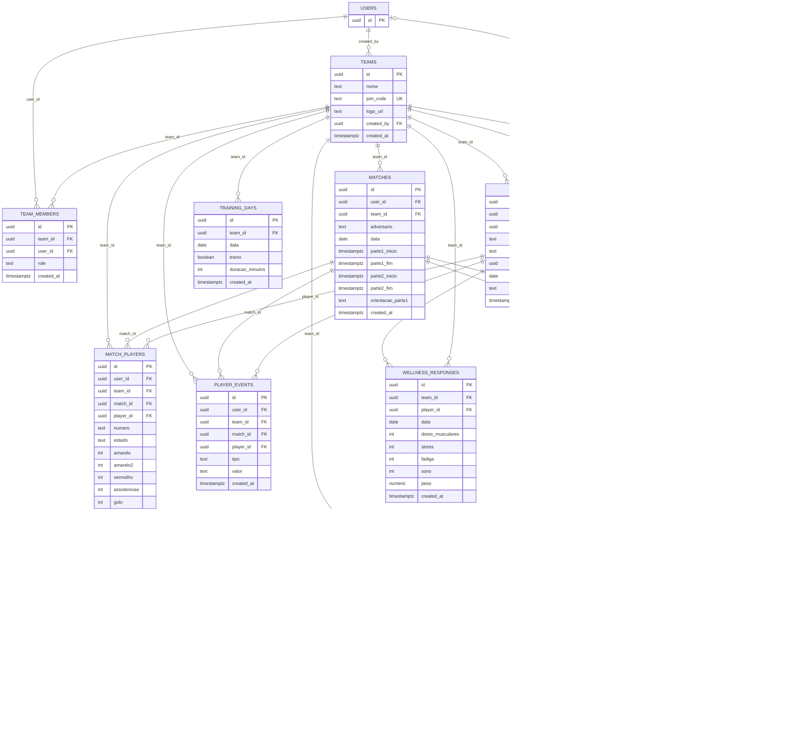

<!--
  Análise de Jogo — supabase/data-model.md
  Logical Data Model da base de dados (Postgres / Supabase): diagrama de
  entidades e relações, seguido de um dicionário de dados por tabela.

  Mantém isto atualizado sempre que supabase/schema.sql mudar (nova coluna,
  nova tabela, nova relação) — idealmente na mesma alteração que cria a
  migração em supabase/migrations/.

  Versão: 1.14 (2026-09-01)
  Histórico:
    1.0 (2026-07-14) — criação, a refletir o esquema depois da migração 011_cruzamentos.sql.
    1.1 (2026-07-15) — events ganha player_id (jogador que fez a ação, opcional).
    1.2 (2026-07-15) — events_normalizado ganha zona_col/zona_row (grelha 6×4, mapa de calor).
    1.3 (2026-08-05) — players ganha login próprio (auth_user_id/data_nascimento/login_email)
                        e a tabela wellness_responses (questionário diário dos jogadores).
    1.4 (2026-08-07) — wellness_responses ganha peso (kg, opcional).
    1.5 (2026-08-07) — função update_wellness_peso(): peso editável várias vezes por dia.
    1.6 (2026-08-07) — policy wellness_team_member_update: o treinador pode corrigir
                        qualquer campo de um dia já registado.
    1.7 (2026-08-07) — policy wellness_team_member_insert: o treinador também pode
                        criar uma resposta em nome de um jogador.
    1.8 (2026-08-27) — match_players ganha numero (opcional): sobrepõe-se ao número de
                        base em players.numero só nesse jogo.
    1.9 (2026-08-31) — nova tabela wellness_rpe (RPE 1-10, só o treinador o vê ou
                        escreve) — separada de wellness_responses de propósito, para o
                        jogador nunca a conseguir ler (RLS é por linha, não por coluna).
    1.10 (2026-08-31) — atualiza a ordem dos 5 campos citada na descrição de "events"
                         (Faltas, Perdas de Bola, Remates, Cruzamentos, Cantos), a
                         acompanhar a nova ordem de TRACKERS em js/match.js.
    1.11 (2026-08-31) — nova tabela goals (um golo é o seu próprio registo, não só
                         um contador) e events ganha "goal_id" opcional — liga um ou
                         mais eventos ao golo que geraram.
    1.12 (2026-08-31) — events_normalizado ganha "goal_id" (o Registo de Jogo
                         normalizado passa a poder destacar os pontos ligados a golo).
    1.13 (2026-08-31) — goals ganha "tipo" ('marcado' ou 'sofrido') — golo sofrido usa
                         a mesma tabela e a mesma ligação a eventos, sem player_id.
    1.14 (2026-09-01) — nova tabela training_days (flag "dia de treino" + duração em
                         minutos, por equipa por dia, sem ligação a jogadores).
-->

# Logical Data Model — Análise de Jogo

Todas as tabelas da aplicação (exceto `auth.users`, gerida pelo Supabase Auth) têm uma coluna `team_id`, e a Row Level Security garante que só um membro dessa equipa (via `team_members`) lê ou escreve essas linhas. `user_id` fica em cada tabela como registo de quem criou a linha, mas não é usado para controlo de acesso — isso é feito a nível de equipa.

Uma exceção: `players` pode opcionalmente ter um login próprio (`auth_user_id`), criado pelo treinador — nesse caso, esse jogador (e só ele) também consegue ver/editar a própria linha em `players` e as próprias linhas em `wellness_responses`, mesmo sem ser `team_member` (ver policies `players_self_select`/`players_self_update`/`wellness_player_select` em `schema.sql`).

## Diagrama de entidades e relações

```mermaid
erDiagram
  USERS ||--o{ TEAMS : "created_by"
  USERS ||--o{ TEAM_MEMBERS : "user_id"
  TEAMS ||--o{ TEAM_MEMBERS : "team_id"
  TEAMS ||--o{ PLAYERS : "team_id"
  TEAMS ||--o{ MATCHES : "team_id"
  TEAMS ||--o{ MATCH_PLAYERS : "team_id"
  TEAMS ||--o{ EVENTS : "team_id"
  TEAMS ||--o{ PLAYER_EVENTS : "team_id"
  TEAMS ||--o{ GOALS : "team_id"
  MATCHES ||--o{ MATCH_PLAYERS : "match_id"
  MATCHES ||--o{ EVENTS : "match_id"
  MATCHES ||--o{ PLAYER_EVENTS : "match_id"
  MATCHES ||--o{ GOALS : "match_id"
  PLAYERS ||--o{ MATCH_PLAYERS : "player_id"
  PLAYERS ||--o{ PLAYER_EVENTS : "player_id"
  PLAYERS ||--o{ EVENTS : "player_id (opcional)"
  PLAYERS ||--o{ GOALS : "player_id (opcional, marcador)"
  GOALS ||--o{ EVENTS : "goal_id (opcional)"
  USERS |o--o| PLAYERS : "auth_user_id (login do jogador, opcional)"
  PLAYERS ||--o{ WELLNESS_RESPONSES : "player_id"
  TEAMS ||--o{ WELLNESS_RESPONSES : "team_id"
  PLAYERS ||--o{ WELLNESS_RPE : "player_id"
  TEAMS ||--o{ WELLNESS_RPE : "team_id"
  TEAMS ||--o{ TRAINING_DAYS : "team_id"

  USERS {
    uuid id PK
  }

  TEAMS {
    uuid id PK
    text nome
    text join_code UK
    text logo_url
    uuid created_by FK
    timestamptz created_at
  }

  TEAM_MEMBERS {
    uuid id PK
    uuid team_id FK
    uuid user_id FK
    text role
    timestamptz created_at
  }

  PLAYERS {
    uuid id PK
    uuid user_id FK
    uuid team_id FK
    text numero
    text nome
    uuid auth_user_id FK
    date data_nascimento
    text login_email
    timestamptz created_at
  }

  MATCHES {
    uuid id PK
    uuid user_id FK
    uuid team_id FK
    text adversario
    date data
    timestamptz parte1_inicio
    timestamptz parte1_fim
    timestamptz parte2_inicio
    timestamptz parte2_fim
    text orientacao_parte1
    timestamptz created_at
  }

  MATCH_PLAYERS {
    uuid id PK
    uuid user_id FK
    uuid team_id FK
    uuid match_id FK
    uuid player_id FK
    text numero
    text estado
    int amarelo
    int amarelo2
    int vermelho
    int assistencias
    int golo
    text substituicao
  }

  EVENTS {
    uuid id PK
    uuid user_id FK
    uuid team_id FK
    uuid match_id FK
    text tracker_id
    int parte
    int minuto
    text tipo
    numeric x_pct
    numeric y_pct
    uuid player_id FK
    uuid goal_id FK
    timestamptz created_at
  }

  GOALS {
    uuid id PK
    uuid user_id FK
    uuid team_id FK
    uuid match_id FK
    text tipo
    uuid player_id FK
    int parte
    int minuto
    timestamptz created_at
  }

  PLAYER_EVENTS {
    uuid id PK
    uuid user_id FK
    uuid team_id FK
    uuid match_id FK
    uuid player_id FK
    text tipo
    text valor
    timestamptz created_at
  }

  WELLNESS_RESPONSES {
    uuid id PK
    uuid team_id FK
    uuid player_id FK
    date data
    int dores_musculares
    int stress
    int fadiga
    int sono
    numeric peso
    timestamptz created_at
  }

  WELLNESS_RPE {
    uuid id PK
    uuid team_id FK
    uuid player_id FK
    date data
    int rpe
    timestamptz created_at
  }

  TRAINING_DAYS {
    uuid id PK
    uuid team_id FK
    date data
    boolean treino
    int duracao_minutos
    timestamptz created_at
  }
```

`events_normalizado` não está no diagrama por ser uma **view** (não uma tabela): é `events` juntado com `matches`, com `x_pct`/`y_pct` rodados 180º quando a orientação da parte não é a de referência. Ver dicionário mais abaixo.

## Dicionário de dados

### `teams`
Equipas, partilháveis entre contas via `join_code`.

| Coluna | Tipo | Obrigatório | Notas |
|---|---|---|---|
| `id` | uuid | sim (PK) | |
| `nome` | text | sim | |
| `join_code` | text | sim (único) | código de convite de 6 caracteres, gerado por `create_team()` |
| `logo_url` | text | não | URL pública no bucket `team-logos` |
| `created_by` | uuid | sim (FK → `auth.users`) | quem criou a equipa |
| `created_at` | timestamptz | sim | |

### `team_members`
Define quem pertence a que equipa — base de toda a Row Level Security.

| Coluna | Tipo | Obrigatório | Notas |
|---|---|---|---|
| `id` | uuid | sim (PK) | |
| `team_id` | uuid | sim (FK → `teams`) | |
| `user_id` | uuid | sim (FK → `auth.users`) | |
| `role` | text | sim | `owner` ou `membro`; único por (`team_id`, `user_id`) |
| `created_at` | timestamptz | sim | |

### `players`
Plantel reutilizável de uma equipa — cada jogador existe uma vez, é convocado por jogo via `match_players`.

| Coluna | Tipo | Obrigatório | Notas |
|---|---|---|---|
| `id` | uuid | sim (PK) | |
| `user_id` | uuid | sim (FK → `auth.users`) | quem adicionou o jogador |
| `team_id` | uuid | sim (FK → `teams`) | |
| `numero` | text | não | |
| `nome` | text | sim | |
| `auth_user_id` | uuid | não (FK → `auth.users`, único) | login próprio do jogador, criado pelo treinador na tab Plantel — dá acesso só a `pages/jogador.html` (perfil + wellness), nunca ao resto da equipa |
| `data_nascimento` | date | não | preenchida pelo próprio jogador no primeiro login (não pelo treinador) |
| `login_email` | text | não | cópia do email de login, só para o treinador se lembrar (o `auth.users.email` não é consultável via PostgREST) |
| `created_at` | timestamptz | sim | |

### `matches`
Jogos de uma equipa, com o cronómetro e a orientação de ataque.

| Coluna | Tipo | Obrigatório | Notas |
|---|---|---|---|
| `id` | uuid | sim (PK) | |
| `user_id` | uuid | sim (FK → `auth.users`) | |
| `team_id` | uuid | sim (FK → `teams`) | |
| `adversario` | text | sim | |
| `data` | date | sim | |
| `parte1_inicio` / `parte1_fim` | timestamptz | não | hora de início/fim da 1ª parte |
| `parte2_inicio` / `parte2_fim` | timestamptz | não | hora de início/fim da 2ª parte; `parte2_fim` definido = jogo terminado (bloqueia edição) |
| `orientacao_parte1` | text | não | `E-D` ou `D-E`; direção de ataque na 1ª parte (a 2ª é sempre o oposto) |
| `created_at` | timestamptz | sim | |

### `match_players`
Convocatória e estatísticas de um jogador num jogo específico.

| Coluna | Tipo | Obrigatório | Notas |
|---|---|---|---|
| `id` | uuid | sim (PK) | |
| `user_id` | uuid | sim (FK → `auth.users`) | |
| `team_id` | uuid | sim (FK → `teams`) | |
| `match_id` | uuid | sim (FK → `matches`) | único por (`match_id`, `player_id`) |
| `player_id` | uuid | sim (FK → `players`) | |
| `numero` | text | não | número específico deste jogo; se vazio, usa o número de base em `players.numero` |
| `estado` | text | sim | `Titular` ou `Suplente` |
| `amarelo` / `amarelo2` | int | sim (default 0) | 2 cartões amarelos; marcar os dois marca `vermelho` automaticamente |
| `vermelho` | int | sim (default 0) | |
| `assistencias` | int | sim (default 0) | |
| `golo` | int | sim (default 0) | |
| `substituicao` | text | não | `Saiu` ou `Entrou` (consoante o `estado`) |

### `events`
Cliques nos 5 campos do Registo de Jogo (Faltas, Perdas de Bola, Remates, Cruzamentos, Cantos), por parte.

| Coluna | Tipo | Obrigatório | Notas |
|---|---|---|---|
| `id` | uuid | sim (PK) | |
| `user_id` | uuid | sim (FK → `auth.users`) | |
| `team_id` | uuid | sim (FK → `teams`) | |
| `match_id` | uuid | sim (FK → `matches`) | |
| `tracker_id` | text | sim | `faltas`, `cantos`, `cruzamentos`, `perdas` ou `remates` |
| `parte` | int | sim (default 1) | 1 ou 2 — a que parte do jogo pertence o clique |
| `minuto` | int | não | minuto do jogo, relativo ao início da parte em que foi marcado |
| `tipo` | text | sim | `X` ou `Y` (significado depende do `tracker_id`, ex: Realizadas/Sofridas) |
| `x_pct` / `y_pct` | numeric | sim | posição do clique no campo, em percentagem |
| `player_id` | uuid | não (FK → `players`) | jogador que fez a ação; opcional — pode ficar por atribuir e corrigir-se depois |
| `goal_id` | uuid | não (FK → `goals`, `on delete set null`) | liga este evento ao golo que ajudou a criar (ex: o cruzamento e o remate de um golo); opcional, escolhido no popup ao marcar o golo |
| `created_at` | timestamptz | sim | |

### `goals`
Um golo é o seu próprio registo (não só o número em `match_players.golo`), para poder ligar-se a um ou mais eventos de `events` que lhe deram origem — ver `goal_id` acima. Um evento só pode contribuir para um golo, por isso a ligação é uma FK direta em `events`, não uma tabela de junção.

| Coluna | Tipo | Obrigatório | Notas |
|---|---|---|---|
| `id` | uuid | sim (PK) | |
| `user_id` | uuid | sim (FK → `auth.users`) | |
| `team_id` | uuid | sim (FK → `teams`) | |
| `match_id` | uuid | sim (FK → `matches`) | |
| `tipo` | text | sim (default `marcado`) | `marcado` ou `sofrido` |
| `player_id` | uuid | não (FK → `players`, `on delete set null`) | marcador do golo — sempre vazio quando `tipo = 'sofrido'` (a app não tem lista de jogadores do adversário) |
| `parte` | int | não | 1 ou 2 |
| `minuto` | int | não | minuto do jogo, relativo ao início da parte |
| `created_at` | timestamptz | sim | |

Escrito diretamente pela app (`js/match.js`), sem RPC. Golo marcado: ao clicar no ⚽ de um jogador (cria o golo + liga os eventos escolhidos no popup) ou ao editar os eventos de um golo já existente (botão "Editar eventos" na secção "Golos do jogo"); apagar (clique direito/Ctrl+clique no ⚽) desliga automaticamente os eventos associados (`on delete set null`), não os apaga, e o contador `match_players.golo` mantém-se como estava, atualizado em paralelo pela app. Golo sofrido: botão "+ Golo sofrido" na secção "Golos sofridos" (sem escolher jogador); "Remover" apaga diretamente, sem passar por nenhum contador (não existe um para golos sofridos).

### `player_events`
Histórico de cada ação clicada na convocatória (auditoria), além dos totais já guardados em `match_players`.

| Coluna | Tipo | Obrigatório | Notas |
|---|---|---|---|
| `id` | uuid | sim (PK) | |
| `user_id` | uuid | sim (FK → `auth.users`) | |
| `team_id` | uuid | sim (FK → `teams`) | |
| `match_id` | uuid | sim (FK → `matches`) | |
| `player_id` | uuid | sim (FK → `players`) | |
| `tipo` | text | sim | `amarelo`, `amarelo2`, `vermelho`, `assistencias`, `golo`, `estado` ou `substituicao` |
| `valor` | text | não | novo valor depois da ação (ex: `"1"`, `"Titular"`, `""` quando desligado) |
| `created_at` | timestamptz | sim | |

### `wellness_responses`
Questionário diário de wellness, preenchido pelo próprio jogador (login próprio) — no máximo um por jogador por dia.

| Coluna | Tipo | Obrigatório | Notas |
|---|---|---|---|
| `id` | uuid | sim (PK) | |
| `team_id` | uuid | sim (FK → `teams`) | |
| `player_id` | uuid | sim (FK → `players`) | único por (`player_id`, `data`) — impede mais de uma resposta no mesmo dia |
| `data` | date | sim (default `current_date`) | dia do servidor (UTC), não o fuso horário do jogador |
| `dores_musculares` | int (0-10) | sim | "Como estão as dores musculares?" — 0 = nenhuma, 10 = muito fortes |
| `stress` | int (0-10) | sim | "Como te sentes hoje em termos de stress?" — 0 = muito relaxado, 10 = muito stressado |
| `fadiga` | int (0-10) | sim | "Como está o teu nível de fadiga?" — 0 = muito fresco, 10 = extremamente cansado |
| `sono` | int (0-10) | sim | "Como classificas o teu sono?" — 0 = muito bom, 10 = muito mau |
| `peso` | numeric | não | peso em kg — o único campo do questionário que é mesmo opcional, e o único editável depois de enviado (ex: pesagem antes/depois do treino) |
| `created_at` | timestamptz | sim | |

O jogador só pode criar a própria resposta do dia via `submit_wellness()` (identifica-o pelo próprio `auth.uid()`, não recebe `player_id` do cliente). O treinador tem duas policies diretas na tabela, sem função: `wellness_team_member_insert` (criar uma resposta em nome de um jogador — ex: dia esquecido, ou dados de teste) e `wellness_team_member_update` (corrigir qualquer campo de qualquer dia). O jogador só pode alterar o próprio `peso` depois de enviado (`update_wellness_peso()`).

### `wellness_rpe`
RPE (*Rate of Perceived Exertion*, 1-10) de um dia/treino, preenchido **só pelo treinador** — nunca pelo jogador. Tabela própria, separada de `wellness_responses`, de propósito: a RLS do Postgres é por linha, não por coluna, e o jogador já tem uma policy de `select` sobre a própria linha em `wellness_responses` — uma coluna `rpe` ali seria automaticamente legível por ele (mesmo sem nenhum ecrã a mostrá-la), porque o `select('*')` de `jogador.js` devolveria o valor à mesma. Como tabela à parte, sem nenhuma policy para o jogador, o valor fica inacessível a nível de base de dados, não só escondido na interface.

| Coluna | Tipo | Obrigatório | Notas |
|---|---|---|---|
| `id` | uuid | sim (PK) | |
| `team_id` | uuid | sim (FK → `teams`) | |
| `player_id` | uuid | sim (FK → `players`) | único por (`player_id`, `data`) |
| `data` | date | sim (default `current_date`) | |
| `rpe` | int (1-10) | sim | perceção de esforço, atribuída pelo treinador |
| `created_at` | timestamptz | sim | |

Só uma policy, `wellness_rpe_team_member` (`for all`, exige `team_members`) — sem RPC, o treinador escreve diretamente na tabela a partir de `pages/dashboard.html` (RPE do dia, tab Wellness) e `pages/wellness-jogador.html` (RPE de qualquer dia já existente em `wellness_responses`, no fluxo de edição). Não há policy nenhuma para o jogador: uma tentativa de leitura pelo `auth_user_id` do jogador devolve sempre zero linhas.

### `training_days`
Flag "dia de treino" + duração (minutos), no topo da tab Wellness. Ao contrário de `wellness_responses`/`wellness_rpe`, **não está ligada a nenhum jogador** — é uma propriedade do dia em si, para a equipa toda — por isso não tem `player_id`, só uma linha por `team_id`+`data`.

| Coluna | Tipo | Obrigatório | Notas |
|---|---|---|---|
| `id` | uuid | sim (PK) | |
| `team_id` | uuid | sim (FK → `teams`) | único por (`team_id`, `data`) |
| `data` | date | sim (default `current_date`) | |
| `treino` | boolean | sim (default `false`) | interruptor "Hoje é dia de treino" |
| `duracao_minutos` | int (> 0) | não | só preenchido quando `treino = true`; a UI limpa-o (`null`) ao desligar a flag |
| `created_at` | timestamptz | sim | |

Só uma policy, `training_days_team_member` (`for all`, exige `team_members`) — sem RPC, `loadTrainingDay()`/`saveTrainingDay()` (`dashboard.js`) leem/escrevem diretamente na tabela via `upsert({ onConflict: 'team_id,data' })`.

### `events_normalizado` (view, não tabela)
Junta `events` com `matches` e roda 180º (`100 - x_pct`, `100 - y_pct`) os pontos da parte cuja orientação de ataque não é a de referência (`E-D`), para que a 1ª e a 2ª parte fiquem representadas no mesmo sentido de ataque.

| Coluna | Origem | Notas |
|---|---|---|
| `id`, `team_id`, `match_id`, `tracker_id`, `parte`, `minuto`, `tipo`, `created_at`, `x_pct`, `y_pct`, `player_id`, `goal_id` | `events` | valores originais, sem alteração |
| `x_pct_normalizado` / `y_pct_normalizado` | calculado | `100 - x_pct` / `100 - y_pct` quando a parte atacou "ao contrário"; senão, igual ao original |
| `zona_col` (0-5) / `zona_row` (0-3) | calculado | posição na grelha 6×4 usada pelo mapa de calor por zonas, derivada de `x_pct_normalizado`/`y_pct_normalizado`. Serve para agregar por zona diretamente em SQL, sem repetir a lógica de "binning" no cliente. |

## Convenções gerais

- Todas as chaves primárias são `uuid`, geradas com `gen_random_uuid()`.
- Toda a escrita/leitura passa por Row Level Security baseada em `team_members` — nunca diretamente por `user_id`.
- Datas/horas são sempre `timestamptz` (com fuso), exceto `matches.data`, que é só a data do jogo (`date`).
